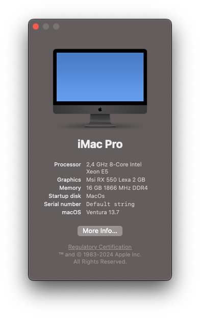

# Hackintosh EFI Configuration

## System Configuration

- Atermiter x99h
- Intel Xeon E5 2630(v3) 
- 16GB Ram
- MSI AMD RX550 Lexa (2GB VRAM)

## Issues

Not Found

## Notes!

If you use radio-channel mouse/keyboard, setup receiver to back usb ports!

Bluetooth Module maybe buggy
